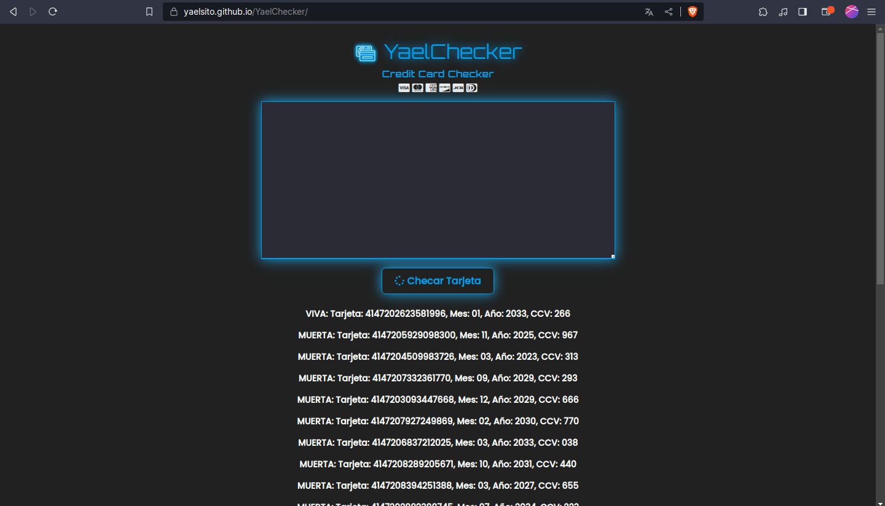
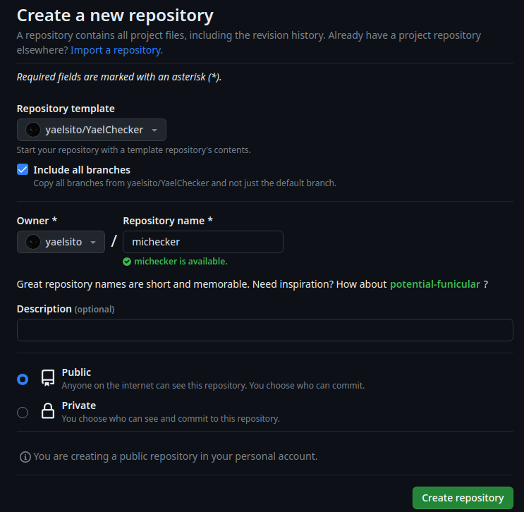
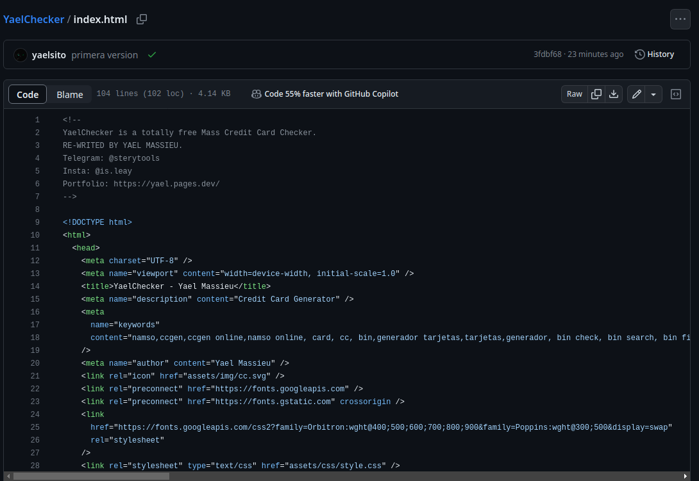
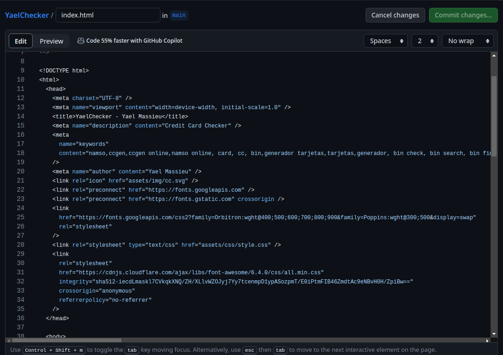
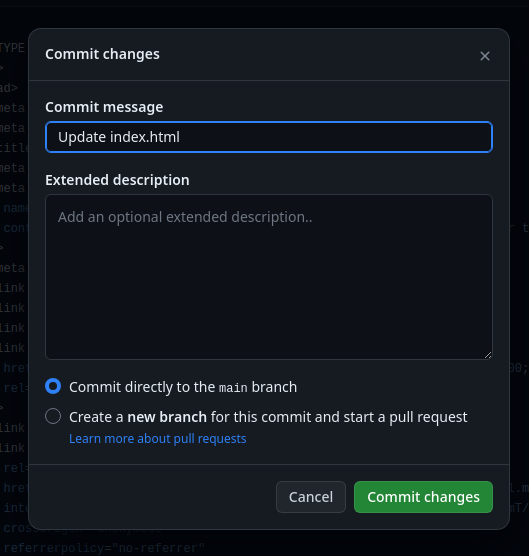
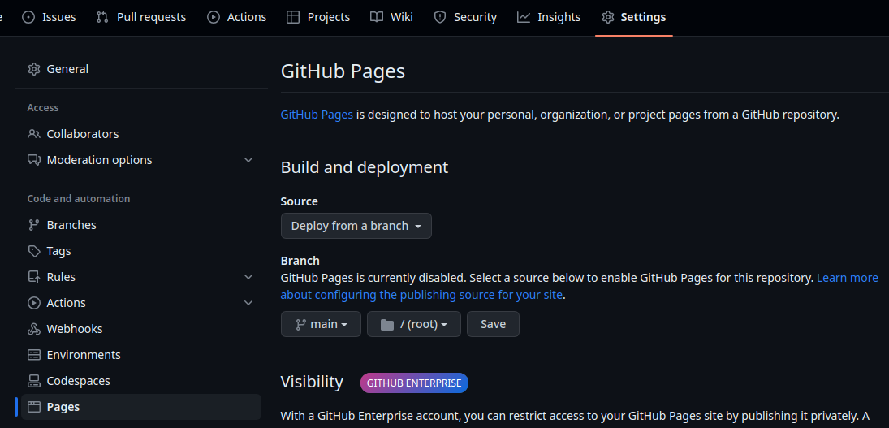
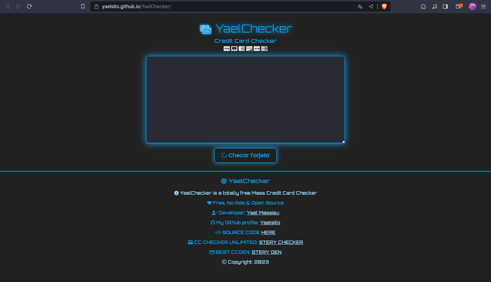

# BIENVENIDO A YaelChecker

Con YaelChecker podrás tener tu propio generador de tarjetas personalizado y online con **Github Pages.**

## PREVIEW de como quedaría:



## Cómo funciona el API?

#### Hacer peticiones:

```http
  POST https://freeapi.stery.us/api/checarCC
```

| Parámetro | Tipo     | Descripción                |
| :-------- | :------- | :------------------------- |
| `tarjetas` | `string` | **FORMATO:** `tarjeta-mes-año-cvv` |

#### LIMITACIONES:

| Solicitudes/Día | Tarjetas/Solicitud     | Descripcion:                       |
| :-------- | :------- | :-------------------------------- |
| `10`      | `20` | Uso gratuito |

#### Descripción detallada:
Solo se permiten 10 solicitudes diarias con 20 tarjetas máximo por solicitud. Si la solicitud está vacía, cuenta como una solicitud correcta.

## Cómo hacer una petición (Javascript)

```javascript
const respuesta = await fetch("https://freeapi.stery.us/api/checarCC", {
      method: "POST",
      headers: {
        "Content-Type": "application/json",
      },
      body: JSON.stringify(tarjetas),
    });
    const datos = await respuesta.json();
```linuxchecker

ven a divertirte
## Obtener tarjetas:

Se puede usar un ciclo FOR para hacerlo.

```javascript
  for (const detalles in datos) {
        const tarjetas = datos[detalles];
        for (const tarjeta of tarjetas) {
          const resultado = `<p>
            ${detalles}:
            Tarjeta: ${tarjeta.ccNum},
            Mes: ${tarjeta.ccMes},
            Año: ${tarjeta.ccAnio},
            CCV: ${tarjeta.ccCodigo}
            </p>`;
          datosDiv.innerHTML += resultado;
        }
      }
```
    
## Propiedades del API disponibles:

- `ccNum`
- `ccMes`
- `ccAnio`
- `ccCodigo`

# TUTORIAL (PARA PRINCIPIANTES)

¿No tienes experiencia en programación? No importa, es sencillo. Primero debes crear tu cuenta de Github. Simplemente registrate en "Signup".

## 1. Usar la plantilla

Selecciona el botón verde "Use this template".


## 2. Configurar el nuevo repositorio

Te mostrará una ventana donde:
  - **Repository name:** será el nuevo nombre de tu repositorio. Ojo: No será el mismo nombre de tu CHECKER pero puedes usarlo.
  - **Include all branches:** garantiza que si en el futuro agrego cosas nuevas, podrás acceder a ellas. Debes marcar la casilla.

Luego, debes darle ***"Create repository from template".***



# 3. Personalización

Ahora verás una pantalla con todos los nuevos archivos del generador, entre ellos: `index.html`
Toca **index.html** y espera que cargue.


Una vez haya cargado, toca el icono del Lapiz para editar el archivo:



## MODIFICAR INDEX.HTML

Ahora verás todas las lineas que conforman el CHECKER.
Recuerda solo editar las cosas que estén dentro del **cuadro rojo y solo como se observa en el ejemplo.**

 - **La línea 14:** Te permite darle un nombre a tu CHECKER, es el que se mostrará en la pestaña del navegador.
   
-   **La línea 15:** Te permite ponerle una descripción a tu CHECKER, la que se mostrará en los buscadores.
   
 -  **La línea 20:** Es para poner tu nombre como autor del CHECKER o bien podrías dejarlo así, no pasa nada.
   
  - **La línea 41:** Te permite darle nombre a tu CHECKER, es el nombre que se mostrará en la página principal y el más importante.
   
   - **La línea 43:** Te permite darle una descripción corta a tu CHECKER, ya sea un eslogan, una frase o algo. se mostrará igual en la página
   principal.



## ACTUALIZAR INDEX.HTML

Ya que hayas terminado de editar a tu gusto, ve hasta abajo de la página y dale al botón verde que dice **"Commit changes"**



> **Nota:** No debes **modificar** ninguna otra cosa, porque puedes dejar inservible tu generador y deberás repetir el proceso.

# PONER ONLINE TU CHECKER

Ya casi hemos terminado, ahora toca poner online tu nuevo CHECKER.  Para eso debes ir a "Settings" en la parte superior.

Ahora dirigete a "Pages" y aquí debes configurar lo siguiente:

 - **Source:** `Deploy from a branch`.
 - 
   **Branch:** `Main`.
 -  
   **Carpeta:** `root` (dejar por defecto luego de elegir `main`).

**Ahora debes darle "SAVE" y esperar.**
Adjunto imagen de cómo debe quedar:



## OBTENER LA URL DE TU CHECKER
Si ya hiciste lo anterior, ahora refresca la página y verás lo siguiente:


> Ahora solo toca el botón **"Visit Site"** y te llevará a tu nuevo
> CHECKER personalizado. Procura guardar ese link en un blog de notas o
> guardarlo como Favorito en tu navegador.

# RESULTADO FINAL
Si has hecho bien todos los pasos, verás este bonito CHECKER personalizado con todos tus datos!



# Preguntas Frecuentes:

## ¿ CÓMO EDITAR LOS ICONOS Y LOGOS?

Cómo pudiste observar, en las líneas **21 y 41** hay archivos **.svg** cuyos nombres son `cc.svg`.

`cc.svg` es el que se muestra en la pestaña del navegador y dentro del generador, el logo principal. Pero puedes usar diferentes logos para ambas cosas. Incluso, usar PNG. Por ejemplo: `logo.png`.

Para editarlos, debes ir a la carpeta `assets`, luego entrar a la carpeta `img` y dentro de ahí **borrar las imagenes**. Luego debes subir las tuyas con los mismos nombres.


## ¿CÓMO VOLVER A MODIFICAR LOS NOMBRES?

Si quieres modificar algún dato, debes volver a editar el archivo HTML siempre y cuando **NO MODIFIQUES NADA QUE SEA LO YA MENCIONADO EN ESTE TUTORIAL.**

# Créditos:

Todo el desarrollo, modificación, colores, y **tiempo** fueron con dedicación por **[Sergio Yael Massieu](https://www.facebook.com/is.leay)**, dueño de [**Stery**](https://stery.us) y programador en ratos libres. Siempre he pensado que si hay conocimiento, hay que esparcirlo al resto de personas, no nos quita nada compartir con los demás.

Si llegaste hasta aquí, muchas gracias. Si quieres realizar una donación o un reconocimiento, puedes escribirme al correo:
yaeldev@tutanota.com

**De nuevo gracias y espero valoren el esfuerzo y tiempo que me tomó hacer todo esto para ustedes** 💕

Mis otras redes:

 - **[Telegram](https://t.me/tools)**
 - [**Instagram**](https://instagram.com/is.leay)
  - [**Github**](https://github.com/yaelsito)
  - [**Twitter**](https://twitter.com/is_leay)
